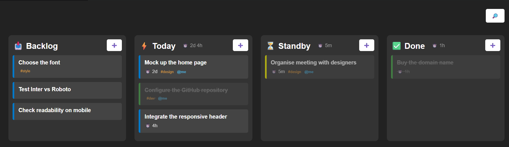

# my-todo.md

A personal todo list manager for VS Code. Transform your Markdown files into interactive Kanban boards with support for task organization, status tracking, and smart tagging.

## Overview

**my-todo.md** allows you to manage your tasks directly in Markdown files with a beautiful Kanban view. Write your tasks in simple Markdown format and visualize them in an interactive Kanban board without leaving VS Code.

## Features

- **📋 Kanban Visualization** - View your Markdown tasks as an interactive Kanban board with customizable columns
- **✅ Task Management** - Toggle tasks between complete and incomplete with a single click
- **📝 Markdown Native** - Write tasks in standard Markdown format using `[ ]` for incomplete and `[x]` for completed
- **🏷️ Smart Tagging** - Organize tasks with hashtags (`#tag`), assign users (`@user`), and set durations (`~2d`)
- **🔄 Real-time Sync** - Changes in the Markdown file automatically update the Kanban view
- **📅 Date Support** - Track task dates with the `YYYY-MM-DD` format for better organization

### Example Format

```markdown
# My TODO

My personal TODO list.

### 📥 Backlog
- [ ] Choose the font #style 2026-05-15
  - [ ] Test Inter vs Roboto
  - [ ] Check readability on mobile

### ⚡ Today  
- [ ] Mock up the home page #design @me ~2d
- [x] Configure the GitHub repository #dev @me 2026-05-03
- [ ] Integrate the responsive header ~4h

### ⏳ Standby
- [/] Organise meeting with designers #design @me ~5m

### ✅ Done
- [x] Buy the domain name ~1h 2026-05-01
```

### View



## Requirements

- VS Code 1.118.0 or higher
- A Markdown file (`.md`) with your tasks

## Installation

1. Install the extension from the VS Code Extensions marketplace
2. Open a Markdown file with task lists
3. Run the command `my todo md: open Kanban` (Ctrl+Shift+P or Cmd+Shift+P)
4. Your Kanban board will appear in a split view

## Commands

This extension contributes the following commands:

* `my-todo-md.openKanban` - Open the Kanban view for the current Markdown file

### Keyboard Shortcut

You can assign a custom keyboard shortcut to the `my-todo-md.openKanban` command via VS Code's keyboard shortcuts settings.

## Known Issues

- Nested sub-tasks within columns are displayed but may require manual synchronization
- Multiple Kanban views for the same file are not yet fully supported

## Release Notes

### 0.0.1

Initial release of **my-todo.md**:

- ✨ Kanban view for Markdown task files
- ✅ Toggle task completion status from the Kanban board
- 🔄 Real-time synchronization between Markdown file and Kanban view
- 🏷️ Support for tags, assignees, and durations
- 📝 Parse and display nested sub-tasks

---

## Following extension guidelines

Ensure that you've read through the extensions guidelines and follow the best practices for creating your extension.

* [Extension Guidelines](https://code.visualstudio.com/api/references/extension-guidelines)

## Working with Markdown

You can author your README using Visual Studio Code. Here are some useful editor keyboard shortcuts:

* Split the editor (`Cmd+\` on macOS or `Ctrl+\` on Windows and Linux).
* Toggle preview (`Shift+Cmd+V` on macOS or `Shift+Ctrl+V` on Windows and Linux).
* Press `Ctrl+Space` (Windows, Linux, macOS) to see a list of Markdown snippets.

## For more information

* [Visual Studio Code's Markdown Support](http://code.visualstudio.com/docs/languages/markdown)
* [Markdown Syntax Reference](https://help.github.com/articles/markdown-basics/)

**Enjoy!**
